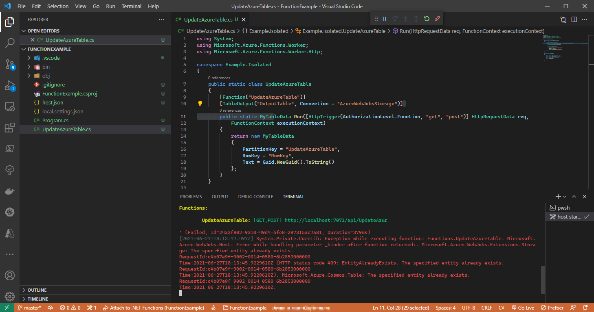
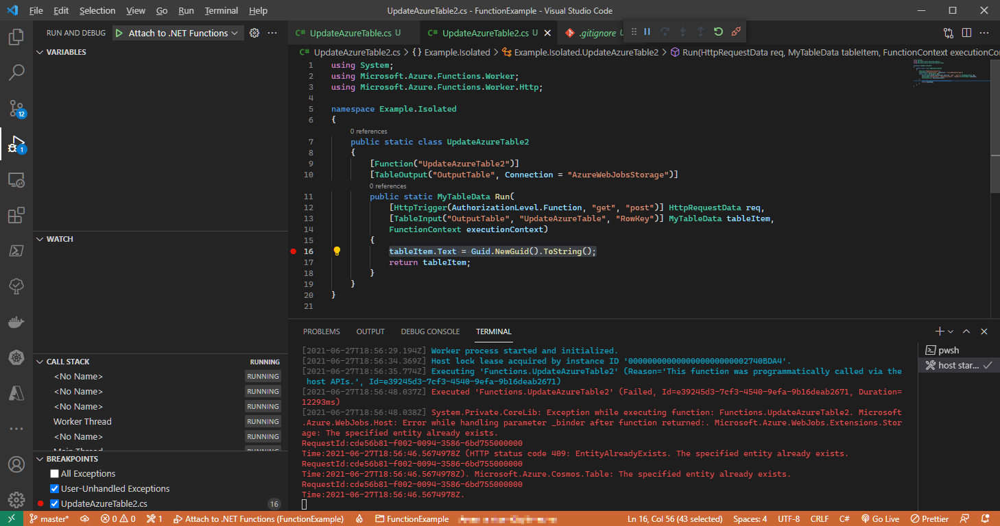

# Information

The exteption I'm getting:

`HTTP status code 409: EntityAlreadyExists. The specified entity already exists`

Create local.settings.json with the following content:

```
{
  "IsEncrypted": false,
  "Values": {
    "AzureWebJobsStorage": "{YourStorageConnectionString}",
    "FUNCTIONS_WORKER_RUNTIME": "dotnet-isolated"
  }
}
```

There are 3 functions

- UpdateAzureTable
- UpdateAzureTable2
- UpdateAzureTable3

The 1st one demonstrates the problem with a simple update.



The 2nd one has the same problem, in case I tried to update a binded/loaded table's entity.



The 3th one is a concept for the scenario I needed, when I try to load a table entity with a rowkey extracted from the request's header information.
